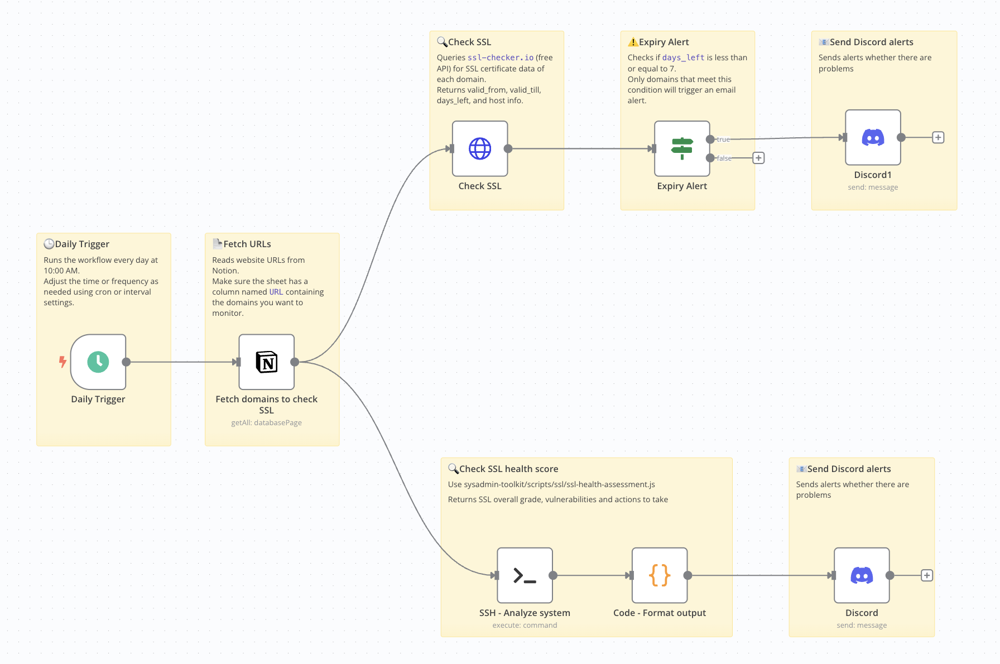

# automation-workflow-monitoring

This repository contains example automation workflows that DevOps teams can use to enhance their monitoring and automation processes. These workflows demonstrate best practices for integrating various monitoring tools and services.

## Author

Created and maintained by Bubobot Team. Visit us at [https://bubobot.com/](https://bubobot.com/).

## Available Workflows

### SSL Certificate Monitoring
**File:** [n8n - SSL Certificate Monitoring](n8n/n8n___SSL_Certificate_Monitoring.json)

A comprehensive SSL health monitoring workflow that combines dual verification systems for maximum accuracy and reliability.

**Workflow Flow:**

**Features:**
- **🔄 Dual Verification System**: Cross-checks results between internal Bubobot SSL scanner and external ssl-checker.io API
- **📊 SSL Labs-Style Grading**: A+ to F rating system with detailed security analysis
- **🛡️ Comprehensive Security Assessment**: Vulnerability detection, protocol analysis, and compliance checking
- **📱 Discord Integration**: Rich embed notifications with color-coded alerts based on severity
- **📄 Professional Reporting**: HTML reports for stakeholder sharing

**What It Monitors:**
- Certificate expiration dates (configurable threshold, default: 30 days)
- SSL configuration security assessment
- Protocol support analysis (TLS 1.3, 1.2, deprecated protocols)
- Cipher suite strength evaluation
- Vulnerability scanning (POODLE, BEAST, etc.)
- Compliance checking (PCI DSS, NIST, FIPS)
- Hostname mismatch detection
- Certificate chain validation

**Alert Levels:**
- **🔴 Critical**: Certificate expired, scan failures, invalid certificates
- **🟠 High**: Expires within 7 days, security vulnerabilities, hostname mismatches
- **🟡 Medium**: Expires within 30 days, poor SSL grades (C/D/F), deprecated protocols
- **🔵 Low**: Recommendations available, minor configuration issues

**Setup Requirements:**
1. **Data Source**: Notion database with `URL` column containing domains to monitor
2. **Credentials**: Discord webhook for alert notifications
3. **Infrastructure**: SSH access to server running sysadmin-toolkit
4. **Customization**: Adjustable thresholds for expiration alerts and grade requirements

**Technical Architecture:**
- **Daily Trigger**: Runs every morning at 10:00 AM for proactive monitoring
- **URL Collection**: Fetches domain list from Notion database
- **Dual SSL Analysis**: 
  - Bubobot SSL Scanner (custom tool from sysadmin-toolkit)
  - SSL-Checker.io API (external verification)
- **Smart Processing**: Code node formats results and determines alert levels
- **Discord Notifications**: Rich embeds with detailed SSL health information

### Incident Response Workflow
**File:** [n8n - Incident Response - 1](n8n/n8n___Incident_Response___1.json)

A comprehensive workflow that handles incident management by integrating AlertManager with PagerDuty, Notion, and Discord notifications.

**Workflow Flow:**

**Features:**
- Automatic incident creation in PagerDuty
- Notion database updates for incident tracking
- Discord notifications for team awareness
- Business hours detection for appropriate routing
- Automatic service restart capabilities by using Lambda function

### AI Agent Decision Engine for Self-Healing Server VPS
**File:** [n8n - AI Agent Decision Engine](./n8n/n8n_AI_Agent_Decision_Engine_for_Self_Healing_Server_VPS.json)

An intelligent automation workflow that uses AI agents to make decisions for self-healing server infrastructure.

**Workflow Flow:**

**Features:**
- AI-powered decision making for infrastructure issues
- Automated self-healing capabilities for VPS servers
- Proactive issue detection and resolution

## Getting Started

### Prerequisites
- n8n instance (self-hosted or cloud)
- Discord webhook URL
- Notion API access (for SSL monitoring workflow)
- SSH access to monitoring server (for SSL monitoring workflow)
- sysadmin-toolkit installed on monitoring server

### Installation Steps
1. **Import Workflows**: Import the JSON files into your n8n instance
2. **Configure Credentials**: Set up Discord webhooks and API credentials
3. **Customize Settings**: Adjust thresholds and alert levels as needed
4. **Test Workflows**: Run test executions to verify functionality
5. **Activate Automation**: Enable scheduled triggers for production use

### Configuration Guide

#### SSL Certificate Monitoring Setup
1. **Notion Database**: Create a database with a `URL` column containing domains to monitor
2. **Discord Webhook**: Set up webhook in your Discord server for SSL alerts
3. **SSH Configuration**: Ensure SSH access to server with sysadmin-toolkit
4. **Threshold Configuration**: Adjust alert thresholds in the workflow nodes
5. **Schedule Setup**: Configure daily trigger timing (default: 10:00 AM)

#### Customization Options
- **Alert Thresholds**: Modify days before expiry for different alert levels
- **Grade Requirements**: Set minimum acceptable SSL grades
- **Notification Channels**: Add additional notification methods
- **Scan Frequency**: Adjust monitoring schedule based on requirements
- **Domain Filtering**: Add custom filters for specific domain types

## Best Practices

### SSL Monitoring
- **Regular Updates**: Keep sysadmin-toolkit updated for latest security checks
- **Threshold Management**: Set appropriate alert thresholds for your environment
- **False Positive Handling**: Review and adjust alert conditions based on your infrastructure
- **Documentation**: Maintain documentation of SSL configurations and renewal procedures

### General Workflow Management
- **Testing**: Always test workflows in development environment first
- **Monitoring**: Monitor workflow execution logs for errors and performance
- **Backup**: Regularly backup workflow configurations
- **Version Control**: Use version control for workflow changes
- **Documentation**: Document customizations and configurations

## Troubleshooting

### Common Issues
- **SSH Connection Failures**: Verify SSH credentials and server accessibility
- **Discord Webhook Errors**: Check webhook URL validity and permissions
- **Notion API Limits**: Monitor API usage and implement rate limiting if needed
- **SSL Scanner Failures**: Verify sysadmin-toolkit installation and dependencies

### Debug Steps
1. Check n8n execution logs for detailed error messages
2. Verify all credentials and API keys are correctly configured
3. Test individual nodes to isolate issues
4. Review workflow connections and data flow
5. Check external service status and API availability

## Support

For support and community engagement, please:
- Open an issue in this repository for bug reports and feature requests
- Email us at support@bubobot.com for direct technical assistance
- Join our DevOps community on Discord: https://discord.gg/qwSKMu4jYA - Connect with fellow engineers focused on system reliability, monitoring, and infrastructure automation

## Contributing

We welcome contributions! Please:
1. Fork the repository
2. Create a feature branch
3. Make your changes
4. Test thoroughly
5. Submit a pull request

## License

This project is open source and available under the MIT License. You are free to:
- Fork and use this repository for your own projects
- Modify and distribute the code
- Use it for commercial purposes
- Contribute back to the project