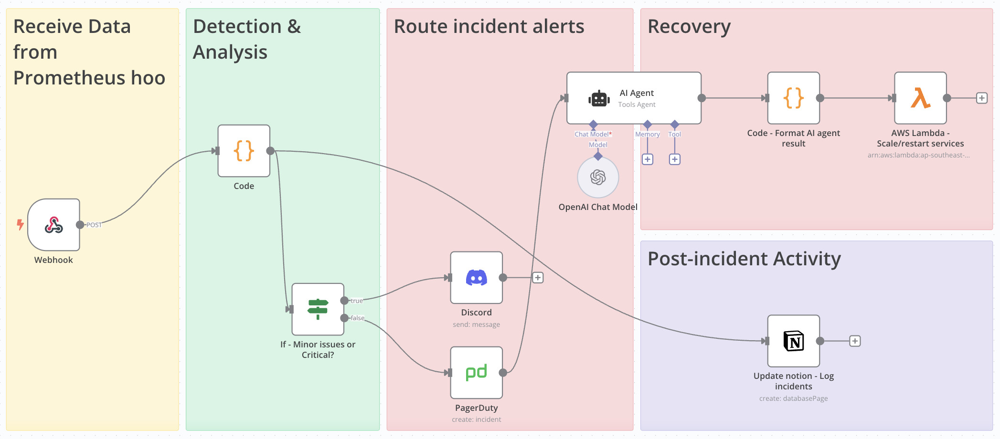
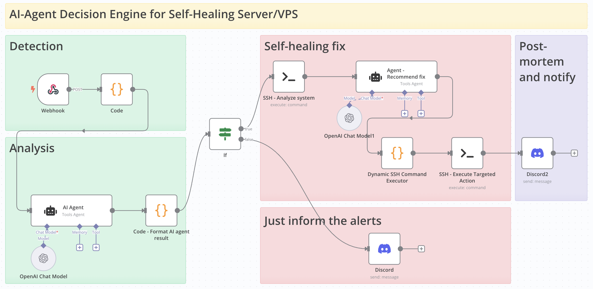

# automation-workflow-monitoring

This repository contains example automation workflows that DevOps teams can use to enhance their monitoring and automation processes. These workflows demonstrate best practices for integrating various monitoring tools and services.

## Author

Created and maintained by Bubobot Team. Visit us at [https://bubobot.com/](https://bubobot.com/).

## Available Workflows

### Incident Response Workflow
**File:** [n8n - Incident Response - 1](n8n/n8n___Incident_Response___1.json)

A comprehensive workflow that handles incident management by integrating AlertManager with PagerDuty, Notion, and Discord notifications.

**Workflow Flow:**

**Features:**
- Automatic incident creation in PagerDuty
- Notion database updates for incident tracking
- Discord notifications for team awareness
- Business hours detection for appropriate routing
- Automatic service restart capabilities by using Lambda function

### AI Agent Decision Engine for Self-Healing Server VPS
**File:** [n8n - AI Agent Decision Engine](./n8n/n8n_AI_Agent_Decision_Engine_for_Self_Healing_Server_VPS.json)

An intelligent automation workflow that uses AI agents to make decisions for self-healing server infrastructure.

**Workflow Flow:**

**Features:**
- AI-powered decision making for infrastructure issues
- Automated self-healing capabilities for VPS servers
- Proactive issue detection and resolution

## Support

For support and community engagement, please:
- Open an issue in this repository for bug reports and feature requests
- Email us at support@bubobot.com for direct technical assistance
- Join our DevOps community on Discord: https://discord.gg/qwSKMu4jYA - Connect with fellow engineers focused on system reliability, monitoring, and infrastructure automation

## License

This project is open source and available under the MIT License. You are free to:
- Fork and use this repository for your own projects
- Modify and distribute the code
- Use it for commercial purposes
- Contribute back to the project